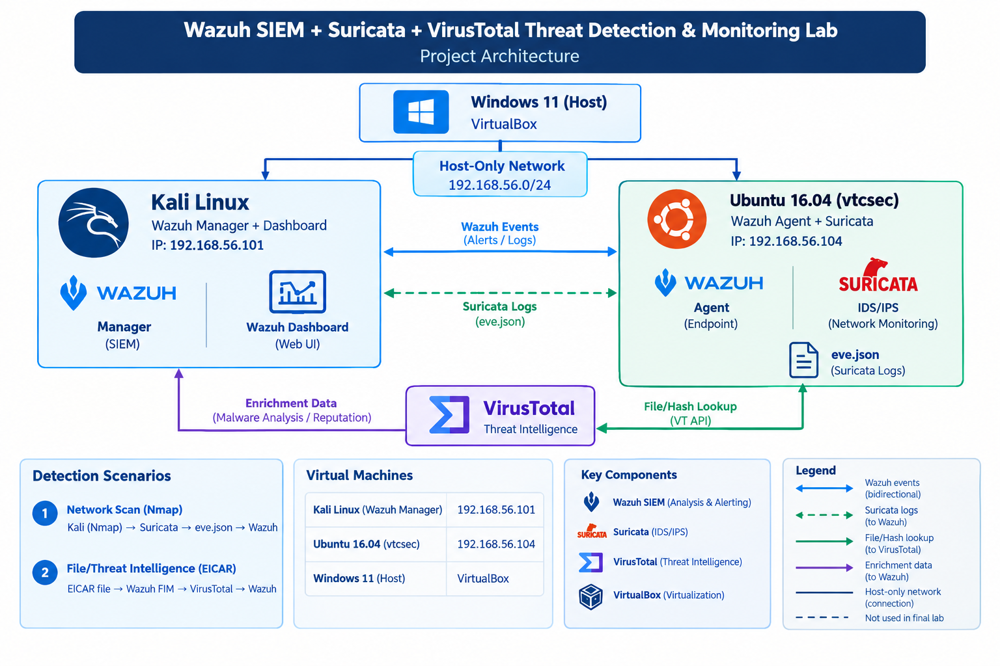

# Wazuh SIEM + Suricata + VirusTotal Threat Detection & Monitoring Lab

## Project Overview

This project demonstrates the design and operation of a small security monitoring lab using Wazuh SIEM, Suricata, and VirusTotal.

The lab was built to simulate common SOC workflows involving network reconnaissance detection, endpoint file monitoring, security alert investigation, and threat intelligence enrichment.

The environment consists of a Kali Linux system running the Wazuh Manager and Dashboard, and an Ubuntu 16.04 endpoint running the Wazuh Agent and Suricata.

Two controlled security-testing scenarios were used to validate the monitoring pipeline:

1. A network scan generated from Kali Linux and detected by Suricata.
2. An EICAR test file created on the Ubuntu endpoint and detected by Wazuh File Integrity Monitoring, followed by VirusTotal enrichment.

The project focuses on demonstrating how security telemetry can be collected, analyzed, enriched, and investigated through a centralized SIEM workflow.

## Objectives

- Deploy and configure Wazuh SIEM for centralized security monitoring.
- Configure a Wazuh Agent on an Ubuntu 16.04 endpoint.
- Deploy Suricata to monitor network traffic and generate security alerts.
- Forward Suricata `eve.json` telemetry to Wazuh for centralized analysis.
- Generate controlled network reconnaissance activity and investigate the resulting alerts.
- Configure VirusTotal integration for threat intelligence enrichment.
- Detect an EICAR test file using Wazuh File Integrity Monitoring.
- Investigate security alerts using a SOC-style workflow.
- Document detection, investigation, analysis, and disposition of security events.
- Produce a recruiter-ready cybersecurity portfolio project demonstrating practical SIEM and threat-detection skills.

## Lab Architecture

The lab uses a Windows 11 host running VirtualBox with two virtual machines connected through a host-only network.

- **Kali Linux** — Wazuh Manager and Wazuh Dashboard
- **Ubuntu 16.04 (`vtcsec`)** — Wazuh Agent and Suricata
- **Host-only network** — `192.168.56.0/24`
- **Kali host-only IP** — `192.168.56.101`
- **Ubuntu endpoint IP** — `192.168.56.104`

Suricata monitors network traffic on the Ubuntu endpoint and writes security telemetry to `eve.json`. The Wazuh Agent collects this telemetry and forwards it to the Wazuh Manager for centralized monitoring and investigation.

VirusTotal is used to enrich relevant endpoint detections with threat intelligence.

## Technologies Used

- **Wazuh** — Security Information and Event Management (SIEM)
- **Suricata** — Network Intrusion Detection System (NIDS)
- **VirusTotal** — Threat Intelligence and File Analysis
- **Kali Linux** — Security testing and network reconnaissance
- **Ubuntu 16.04** — Monitored endpoint
- **VirtualBox** — Virtualization platform
- **Nmap** — Controlled network scanning
- **EICAR Test File** — Safe malware-detection test

## Environment

### Host System

- **Operating System:** Windows 11 Pro
- **CPU:** 11th Gen Intel Core i7-1185G7
- **RAM:** 16 GB
- **Virtualization:** Oracle VirtualBox 7.2.10

### Wazuh Server

- **Operating System:** Kali Linux Rolling
- **Role:** Wazuh Manager and Wazuh Dashboard
- **Host-only IP:** `192.168.56.101`
- **Wazuh Version:** 4.14.7

### Monitored Endpoint

- **Operating System:** Ubuntu 16.04.3 LTS
- **Hostname:** `vtcsec`
- **Role:** Wazuh Agent and Suricata
- **Host-only IP:** `192.168.56.104`
- **Wazuh Agent Version:** 4.14.7

## Installation & Configuration

The laboratory environment was built using two VirtualBox virtual machines connected through a host-only network.

### Network Configuration

The host-only network uses the `192.168.56.0/24` subnet.

- Kali Linux: `192.168.56.101`
- Ubuntu endpoint (`vtcsec`): `192.168.56.104`

This isolated network allows the security-testing traffic generated by Kali to reach the monitored Ubuntu endpoint without involving external systems.

### Wazuh Configuration

The Wazuh Manager was configured on Kali Linux with the Wazuh Dashboard for centralized security monitoring.

The Ubuntu endpoint was configured with the Wazuh Agent and registered with the Wazuh Manager using TCP port `1514`.

### Suricata Configuration

Suricata was configured on the Ubuntu endpoint to monitor the host-only network interface.

Security events are written to:

`/var/log/suricata/eve.json`

The Wazuh Agent was configured to collect the Suricata JSON event log and forward the telemetry to the Wazuh Manager.

### VirusTotal Configuration

The Wazuh Manager was configured with the VirusTotal integration to enrich relevant File Integrity Monitoring events with threat intelligence.

The API key is stored in the Wazuh configuration and is **not included in this repository**.

## Wazuh SIEM Setup

Wazuh was deployed on the Kali Linux virtual machine to provide centralized security monitoring and investigation.

The Wazuh Manager receives security events from the Ubuntu endpoint through the Wazuh Agent.

The Wazuh Dashboard provides a centralized interface for:

- Monitoring security alerts
- Searching and filtering events
- Investigating individual alerts
- Reviewing agent activity
- Analyzing security telemetry from Suricata
- Reviewing File Integrity Monitoring events

The Ubuntu endpoint (`vtcsec`) was successfully connected to the Wazuh Manager and reported an active agent status.

The Wazuh Agent was also configured to collect Suricata's JSON event log:

`/var/log/suricata/eve.json`

This allowed Suricata network detections to be forwarded into Wazuh for centralized analysis.

## Suricata Integration

Suricata was deployed on the Ubuntu 16.04 endpoint (`vtcsec`) to monitor network traffic and detect suspicious activity.

Suricata was configured to monitor the host-only network interface:

`enp0s8`

Detected events are written to the JSON event log:

`/var/log/suricata/eve.json`

The Wazuh Agent monitors this log and forwards the events to the Wazuh Manager.

### Detection Workflow

Kali Linux → Network Scan → Suricata → `eve.json` → Wazuh Agent → Wazuh Manager → Wazuh Dashboard

A controlled Nmap SYN scan was performed from Kali against the Ubuntu endpoint:

`192.168.56.104`

Suricata generated multiple ET SCAN alerts, including detections associated with database service ports and VNC scanning.

The resulting Suricata telemetry was successfully received and displayed in Wazuh, allowing the network activity to be investigated centrally.

## VirusTotal Threat Intelligence Integration

VirusTotal was integrated with Wazuh to provide threat intelligence enrichment for file-related security events.

A controlled EICAR test file was created on the monitored Ubuntu endpoint:

`/root/eicar.com`

Wazuh File Integrity Monitoring detected the creation of the file and generated a security alert.

The VirusTotal integration submitted the detected file information for
threat-intelligence enrichment and returned results to Wazuh, including
detection status, hashes, and a VirusTotal permalink.

### Detection Workflow

EICAR Test File → Wazuh FIM → VirusTotal → Threat Intelligence Enrichment → Wazuh Alert

The EICAR test file was used because it is specifically designed to safely test antivirus and malware-detection controls without using real malware.

The VirusTotal API key used by the integration is not included in this repository.

## Detection & Investigation

The lab was validated using two controlled security-testing scenarios.

### Scenario 1 — Network Reconnaissance Detection

A controlled Nmap SYN scan was launched from Kali Linux against the Ubuntu endpoint (`192.168.56.104`).

Suricata detected the resulting network traffic and generated multiple ET SCAN alerts.

The alerts were written to `eve.json` and collected by the Wazuh Agent. Wazuh then displayed the Suricata events in the Threat Hunting interface for centralized investigation.

The activity was classified as:

**True Positive — Authorized Security Testing**

The source system was an authorized laboratory machine, and the scan was intentionally generated to validate the detection pipeline.

Detailed investigation notes are available in:

`Network-Scan-Investigation.md`

### Scenario 2 — EICAR File Detection and Threat Intelligence Enrichment

An EICAR test file was created on the Ubuntu endpoint at:

`/root/eicar.com`

Wazuh File Integrity Monitoring detected the newly created file and generated a file-added alert.

The event was subsequently enriched through the VirusTotal integration, providing additional file intelligence including hashes, detection status, and a VirusTotal permalink.

The activity was classified as:

**True Positive — Authorized Security Testing**

The EICAR file was intentionally introduced as part of the laboratory validation process.

Detailed investigation notes are available in:

`virustotal-investigation.md`

## Evidence / Screenshots

The following screenshots document the main stages of the laboratory validation.

### Environment & Services

- `01-wazuh-server-baseline.png` — Wazuh server environment and network configuration
- `02-wazuh-server-status.png` — Wazuh Manager and Dashboard services running
- `03-csec-endpoint-baseline.png` — Ubuntu endpoint environment and network configuration
- `04-wazuh-agents-connected.png` — `vtcsec` successfully connected to the Wazuh Manager
- `05-suricata-running-csec.png` — Suricata running on the Ubuntu endpoint
- `06-wazuh-agent-running-csec.png` — Wazuh Agent running on the Ubuntu endpoint

### Network Detection

- `07-suricata-scan-alerts.png` — Suricata detection of controlled network scanning activity
- `08-wazuh-suricata-alert.png` — Suricata alert received and displayed by Wazuh
- `09-network-scan-investigation.png` — Wazuh event details used to investigate the network scan

### File Detection & Threat Intelligence

- `10-eicar-file-detection.png` — EICAR file creation detected by Wazuh
- `11-virustotal-alert.png` — VirusTotal alert and enrichment result in Wazuh
- `12-virustotal-enrichment.png` — VirusTotal file and hash enrichment details

## Challenges & Troubleshooting

Several configuration and compatibility issues were encountered during the development of the lab.

### Suricata Compatibility

The initial Suricata installation used an older Ubuntu package version that was not fully compatible with the newer Emerging Threats ruleset.

This resulted in rule-loading errors involving unsupported rule keywords.

The issue was resolved by using a compatible Suricata installation and configuring a compatible Emerging Threats ruleset.

### Wazuh Integration

The Suricata `eve.json` output initially required additional configuration before it could be successfully consumed by the Wazuh Agent.

The Wazuh Agent was configured with a JSON log collector for:

`/var/log/suricata/eve.json`

After restarting the agent, Suricata events became available for centralized analysis in Wazuh.

### Network Configuration

The virtual machines required a consistent host-only network configuration so that the Wazuh Manager, monitored endpoint, and controlled testing traffic could communicate reliably.

The final lab uses the `192.168.56.0/24` host-only network.

### DNS Resolution

The Ubuntu endpoint initially experienced DNS resolution problems while attempting to access external resources.

DNS configuration was corrected so that the endpoint could resolve external domains when required for the laboratory setup.

### EICAR Testing

The EICAR test file could not initially be downloaded because of DNS resolution issues.

The standard EICAR test string was therefore created locally on the monitored endpoint for the detection test.

These troubleshooting steps helped validate the individual components and the complete detection pipeline.

## Key Findings

- Wazuh successfully centralized security telemetry from the Ubuntu endpoint.
- Suricata successfully detected controlled network reconnaissance activity.
- Suricata events were successfully forwarded to Wazuh through `eve.json`.
- Wazuh File Integrity Monitoring successfully detected creation of the EICAR test file.
- VirusTotal successfully enriched the file-related detection with additional threat-intelligence information.
- The two scenarios demonstrated an end-to-end workflow from event generation through detection, investigation, enrichment, and analyst disposition.
- The controlled testing environment allowed security detections to be validated without targeting unauthorized systems.

## Skills Demonstrated

- SIEM deployment and configuration
- Wazuh Manager and Agent administration
- Security event monitoring and analysis
- Network intrusion detection with Suricata
- Network reconnaissance detection
- File Integrity Monitoring (FIM)
- Threat intelligence enrichment with VirusTotal
- Alert investigation and triage
- True Positive / False Positive analysis
- SOC-style incident documentation
- Linux system administration and troubleshooting
- Virtual machine and network configuration
- Security telemetry collection and log analysis

## Lessons Learned

This project provided practical experience in building and troubleshooting a small security monitoring environment.

Key lessons included:

- Understanding how endpoint and network telemetry can be collected and centralized through a SIEM.
- Understanding the relationship between Suricata alerts, JSON event logs, and Wazuh analysis.
- Practicing alert investigation using source and destination IP addresses, ports, signatures, and event metadata.
- Understanding how File Integrity Monitoring can identify changes to monitored files.
- Learning how Threat intelligence can provide additional context during an investigation.
- Practicing the distinction between a security detection and the actual disposition of the underlying activity.
- Developing a structured approach to documenting detection, investigation, analysis, and conclusions.
- Troubleshooting Linux services, networking, DNS, configuration files, and software compatibility issues.

## Future Improvements

Potential extensions to the laboratory include:

- Add additional Windows endpoints to the Wazuh environment.
- Develop custom Wazuh detection rules for specific security events.
- Expand Suricata monitoring and detection coverage.
- Integrate additional Threat-intelligence sources.
- Create automated alert-response workflows.
- Add dashboards for security event trends and detection metrics.
- Simulate additional SOC scenarios such as brute-force attempts, suspicious authentication activity, and web-based attacks.
- Expand the investigation documentation with additional case studies and analyst notes.